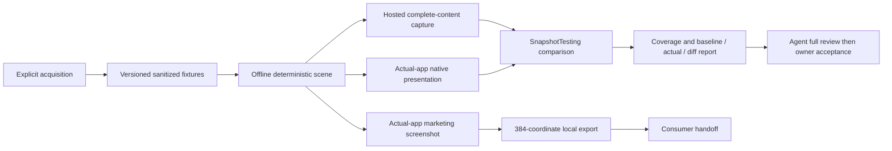

# Phase 17: Screenshot Automation, Visual Regression & OS 27 Modernization - Research

**Researched:** 2026-10-02
**Domain:** SwiftUI/UIKit capture, XCTest/Swift Testing, offline fixtures and local export
**Confidence:** MEDIUM; bounded runtime proof and explicit execution gates

<user_constraints>
## User Constraints (from CONTEXT.md)

[CITED: .planning/phases/17-localized-screenshot-capture-harness/17-CONTEXT.md; copied verbatim below]

### Locked Decisions

<!-- DATA_K7P3RX91_START -->
## Implementation Decisions

### Separate test and marketing workflows

- **D-01:** Adopt `swift-snapshot-testing` for test snapshots. Marketing must use a separate workflow that builds and drives the actual app in iOS Simulators and captures normal device-size screenshots. Keep their output images and regression references separately identifiable. Sharing underlying fixture data is optional. Marketing's status-bar and device-chrome requirements must not complicate or destabilize snapshot tests.
- **D-02:** Snapshot-test data may be real, synthetic or mixed, chosen by the agent for test needs. Marketing gallery content must be real. The agent may choose provisional marketing galleries under the owner's 2026-10-02 delegation; final content uses the owner's identifiers before phase closure. Do not carry forward the old requirement that every test use the marketing galleries.
- **D-03:** Retain explicit acquisition/refresh of real-gallery metadata, covers, previews and required reader assets into reusable versioned fixtures, with provenance and checksums. Capture and regression runs consume saved fixtures offline, make no live-gallery requests and do not depend on a real account or personal library. Credentials and private session state must not enter fixtures.

### Owner-selected marketing content

- **D-04:** During planning, determine required gallery quantities and content characteristics. The owner deferred choosing galleries on 2026-10-02 and explicitly authorized the agent to choose provisional galleries at its discretion; do not wait for those choices or ask again now. The owner will provide chosen gallery identifiers before closing Phase 17. Record the remaining final set assignments, ordering, reader pages and scene inputs as a pre-closure checkpoint; regenerate and revalidate affected captures with the final selections. Content needs must not become imposed category-based gallery selection or filtering requirements.
- **D-05:** The agent chooses real provisional marketing galleries under the owner's delegation and records that provenance explicitly. Before phase closure, replace them with the owner's final identifiers and `nonexplicit`/`explicit` assignments; never infer set labels from app categories. Every visible gallery in Home, Detail, Comments, Reading, Live Text and Downloads must come from the active declared selection. Use one fixed gallery flow within each selected content set; reuse across different screens is allowed, but the same gallery must never appear twice on one screen, including across its sections. Honor configured ordering and reader pages. Provisional captures are not final accepted marketing delivery.
- **D-06:** The website contract explicitly permits deterministic simulation of Live Text highlights and download items **through the app's real UI**. Simulated download items reference selected real galleries; Live Text highlights belong to the selected real reader page. They must look like normal use, with no mock/debug labels. This permits controlled presentation and operation state, not invented marketing gallery content.

### Snapshot matrix and capture extent

- **D-07:** Inventory current app screens and meaningful states, including separately presented sheets, native menus/dialogs, empty/loading/error states, reader panels and previews. Preserve the full regression scope: every supported app locale (`en`, `de`, `ja`, `ko`, `zh-Hans`, `zh-Hant`), all supported Dynamic Type sizes, portrait and landscape, iPhone and iPad, and light/dark appearance. Maintain an explicit machine-readable matrix; report each requested coordinate as captured, failed or justified not applicable. Do not replace full coverage with representative samples. The website's eight-state portrait matrix does not narrow regression coverage.
- **D-08:** Test snapshots should adjust container height to capture complete content in one image. Research must establish a working method for the app's actual ScrollView/List/lazy content; the reduced-width probe does not establish full-content capture. Marketing remains one normal device-size image per screen/state at a selected fixed capture position. No marketing long-image or stitching decision was made.
- **D-09:** Do **not** add a separate reduced-window/narrow-container iPad snapshot dimension. Retain full-size phone/tablet portrait and landscape scope. The historical reduced-width feasibility probe established configured view-layout rendering, not actual iPadOS window-resize automation; its older library presets are not approved production dimensions.
- **D-10:** Freeze the rendering environment, time/time zone, stable IDs and data ordering, image readiness, animation state and simulator configuration. Research/planning determines coherent snapshot dimensions, safe areas, traits and scale without inferring current hardware geometry from a library preset name. Native toolbar/menu/sheet verification remains required and must not be replaced solely by isolated view snapshots.

### Baselines, review and PR coverage

- **D-11:** Commit snapshot baselines alongside test source in this repository, using test data suitable for public distribution. This supersedes carrying Phase 16's outside-repository image rule into Phase 17 test baselines; it does not authorize indiscriminately committing real-gallery marketing assets. The owner deleted old Phase 16 screenshots: do not assume those image files remain available. Their absence does not rescind recorded owner dispositions.
- **D-12:** The agent first visually reviews the **complete** snapshot result set and surfaces layout issues and differences. The owner gives final approval to accept new or changed baselines. Routine comparisons never overwrite references; baseline recording/updating is an explicit operation. Existing defects must not silently become approved baselines.
- **D-13:** Run the **complete snapshot matrix for every PR**, accepting longer runtime. Also retain the complete matrix as a release gate. Do not substitute sampled PR coverage. Optional individual-case filters may help local investigation but must declare reduced coverage.
- **D-14:** Provide a browsable comparison report grouped by screen, with baseline/actual/diff side by side and filters for locale, text size and device. Keep actionable failures and actual/reference/diff artifacts. Pin rendering characteristics, document any justified comparison tolerance, and prove regression detection with a controlled layout change that fails and passes again after removal. Snapshot equality alone does not establish initial layout correctness.

### Locked website screen states

- **D-15:** Export these eight identities. Verify names and navigation against current code; do not identify screens through legacy filenames or capture the retired slide-menu screen.

| Export ID | App view | Required state |
| --- | --- | --- |
| `home` | `HomeView` | Populated Home dashboard |
| `detail` | `DetailView` | Populated gallery detail |
| `comments` | `CommentsView` | Readable, populated gallery comments |
| `filters` | `FiltersView` | App-default filter state; no adjusted conditions |
| `reading` | `ReadingView` | Fully loaded chosen gallery page in the normal reader |
| `reading-live-text` | `ReadingView` | Live Text active, with recognized regions highlighted |
| `downloads` | `DownloadsView` | Realistic, populated items referencing selected galleries |
| `laboratory` | `LaboratorySettingView` | Network-bypass setting visible and **enabled**, using its normal purple-card appearance |

Every state must be populated except Laboratory, which may legitimately be sparse. Reset Filters to app defaults rather than inheriting personal persisted settings. Capture-only Laboratory state belongs in isolated capture configuration.

### Website capture matrix and quality

- **D-16:** Capture every combination of the eight states, six locales (`en`, `de`, `ko`, `ja`, `zh-Hant`, `zh-Hans`), light/dark appearance, `iphone`/`ipad` families and `nonexplicit`/`explicit` sets: **384 expected coordinates, 192 per family**. Use portrait orientation and one fixed documented simulator model per family: **iPhone Air** and **iPad Pro 11-inch (M5)**, as already selected. Pin OS/runtime and record actual pixel dimensions. The iPhone batch may be delivered first, with incomplete coverage explicitly reported. The website has no separate Dynamic Type axis; pin and document the configured text size rather than adding an unrequested marketing dimension.
- **D-17:** Inspect existing app/tooling and reuse suitable mechanisms. Build and drive this repository's actual app locally, with capture-only setup isolated from release behavior and test assets excluded from the release payload. Before each capture verify screen identity, locale, appearance, device and the actual configured selections/state. Wait for images and layout to settle; reject unintended loading, error, empty or transient states. Legitimate Laboratory sparsity is not a failure.
- **D-18:** Pin status-bar values, timestamps, ordering, scroll position, animation state and simulated progress. Marketing status-bar time is **9:41** and the owner requested removal of the Dynamic Island capsule area. Research must establish the working capture/chrome method; do not assume this is implemented. Verify **byte-identical reruns** for unchanged app, runtime and inputs, and report any unresolved nondeterminism. Read credentials only from the local environment; keep them out of tracked files, logs, screenshots and CI secrets.
- **D-19:** Chrome-only screens may look identical between content sets. Explicitly record any proposed asset sharing; never silently substitute another locale, appearance, device or content set. Every expected coordinate remains represented in the inventory.

### Website export contract and local handoff

- **D-20:** No image format is required. Export the format natively supported by capture tooling without unnecessary conversion; the website consumer handles conversion later. Suggested layout: `images/<set>/<screen>/<device>-<locale-token>-<theme>.<extension>`. Use lowercase filename tokens `zh-hant`/`zh-hans`; retain canonical `zh-Hant`/`zh-Hans` locale identifiers in metadata.
- **D-21:** Deliver image files, a machine-readable inventory covering **every expected coordinate including missing or failed captures**, capture instructions and a results report. Each inventory entry records:
  - Screen ID and app view/state; locale, appearance, device family and content set.
  - Relative path, actual format, actual dimensions, byte count and SHA-256.
  - Simulator model, OS/runtime, rendering environment, text size and orientation.
  - App commit/build, capture configuration identifier and fixture version.
  - Selected gallery/page references, without credentials.
  - Outcome, state-verification results and any asset-sharing declaration.
- **D-22:** Provide one documented command for the full export, with optional filters for individual combinations. Return export location, commands, coverage counts, reproducibility results and remaining gaps. Keep export local: the website consumer stages files, generates a labelled thumbnail sheet, obtains maintainer review, converts as needed and promotes approved images. Icon assets are already supplied; no icon work. Validate the local consumer contract/importability without treating public publishing as part of capture.

### AltStore designer ownership

- **D-23:** AltStore requires **App Store-style promotional images with deliberate visual design**, using app screenshots as source material. Standalone raw screenshots do not satisfy that requirement. Record a separate task/responsibility for a **designer agent** to create those promotional assets. The current capture/discussion agent must not participate in AltStore image design or use `impeccable` for this task; the owner explicitly instructed this.
- **D-24:** No AltStore screen list, count, order, locale/appearance/content-set matrix, composition, copy, dimensions or device-frame treatment was selected. Leave those decisions to the separately assigned designer rather than inheriting the website's eight-state list or 384-coordinate matrix. The capture pipeline remains responsible for screenshot source material and metadata; coordinate any additional inputs with the designer during planning. Record consumer-compatible delivery and validate intended `AltStore.json` references without choosing the design or publishing assets. The owner asked to record designer ownership, not to dispatch a designer or create another chat during discussion.

### Existing modernization and subsequent layout audit

- **D-25:** The iOS/iPadOS 27 minimum, Swift 6.4 toolchain, native overflow/priority controls, title/search behavior and soft top-edge migration already landed in quick task `260921-f5u`. Plan against current implementation and coverage rather than repeating a platform upgrade or restoring withdrawn workarounds. The older quick-task W-38 pending wording is historical; current Phase 16 verification records owner-approved closure and remaining bounded evidence. Preserve native `.inlineLarge` root titles, sheet-specific title behavior and search focus/query/orientation behavior at standard, AX1, AX3 and AX5 sizes, including cold entry and live size changes on iPhone/iPad.
- **D-26:** Keep the app-owned top-edge policy `.scrollEdgeEffectStyle(.soft, for: .top)` at each effective scroll/page hierarchy and each independent presentation root. Owned UIKit hosts use their equivalent native property. Preserve system-owned scroll internals. The page inventory is authoritative for existing attachment points; new capture-relevant pages/presentations follow the same policy. Retain native overflow action behavior, Picker/Toggle marks and correct stable action-source alert/popover anchors.
- **D-27:** **After snapshot implementation**, audit layout decisions that depend on device type and replace those branches with size-class-based decisions. Include client-mediated device idiom reads and derived helper flags, not only direct UIDevice reads. Use the completed snapshot coverage to assess changes. This is an owner-added current-phase task, not a deferred idea. Legitimate non-layout capability checks remain outside this audit's removal scope. Size class does not identify an iPadOS window-management mode; retain appropriate container-responsive fitting where needed.
<!-- DATA_K7P3RX91_END -->

### the agent's Discretion

<!-- DATA_M8Y5CV02_START -->
### Agent discretion and research obligations

The owner delegates test-data choices (D-02). Researcher/planner determines the technical mechanisms for fixtures, snapshot integration, deterministic actual-app capture, matrix execution and comparison reporting while respecting locked coverage, output and ownership decisions. Do not present unsupported technical options to the owner: first establish feasibility through primary documentation/current SDK inspection and relevant runtime evidence.

Research must resolve full-content capture for real scroll/list/lazy screens, native menu/dialog/sheet coverage, coherent current device dimensions/traits, status-bar/capsule presentation and repeatability. The prior probe is bounded evidence only; it also reported upstream SDK deprecation warnings, so it is not proof of a clean integration. Follow repository lint rules without suppressions or bypasses.

The agent may supply provisional gallery URLs, set assignments, reader pages/order and Home/Comments/Downloads scene inputs. Final owner identifiers and any missing final assignments are required before closure, with regeneration and revalidation under D-04/D-05. AltStore design decisions belong to its designer. No pending todo matched this phase.

The owner also requested research into Xcode 27's agent-oriented features and preview access on 2026-10-02. The research records current MCP/RenderPreview capabilities, successful project rendering and destination/determinism limits; use verified preview tooling as a development/review aid while preserving D-01's two capture workflows.
<!-- DATA_M8Y5CV02_END -->

### Deferred Ideas (OUT OF SCOPE)

<!-- DATA_N2F9BZ64_START -->
None. AltStore designer work and the post-snapshot layout audit are current-phase responsibilities. Final owner content inputs remain required before phase closure; provisional selections allow development to continue. Consumer-side website staging/conversion/promotion and public publishing remain outside this local capture handoff.
<!-- DATA_N2F9BZ64_END -->
</user_constraints>

## Superseding Human Instruction

[CITED: direct owner steering, 2026-10-02] The owner authorized agent-discretion **provisional** marketing galleries because he does not have time to choose now. He will supply final gallery identifiers before Phase 17 closes. This supersedes the selection-only restriction above for provisional work. Do not ask for selections now. Track provisional/final provenance explicitly; final IDs, set assignments, ordering and reader pages require regeneration and revalidation before closure. No live acquisition was performed during research.

## Summary

[CITED: current Phase 17 context] Use two independent workflows: SnapshotTesting regression assertions and actual-app simulator marketing capture. Use public synthetic test data initially. Implement the complete matrix before the device-idiom layout audit. Preserve the already-landed modernization.

[CITED: upstream 1.19.6 sources below] Full-content capture is **not yet proven** for the actual app. The library's SwiftUI `.sizeThatFits` uses a zero-size proposal; it does not enumerate lazy rows or promise complete List content. Make actual-screen full-content capture a bounded feasibility task with explicit pass/fail conditions before expanding coverage. Native menus/dialogs/sheets require actual-app framebuffer assertions as well as hosted content snapshots.

**Primary recommendation:** Establish finite-fixture full-content and native framebuffer capture first; then build coverage accounting, strict comparisons, review reporting, marketing export, and the post-snapshot layout audit.

## Project Constraints (from AGENTS.md)

[CITED: AGENTS.md; .swiftlint.yml] Preserve the thin shell/local-package boundary; dependencies belong in Package.swift. New reducers use the Feature suffix. New source modules inherit the root lint configuration. No new lint suppression, warning suppression or validation bypass. Numeric localization parameters use named substitutions; strings remain positional; non-translated keys fill all supported locales. Preserve download-manifest SSOT and the same-run folder deletion invariant. Dialogs remain attached to stable triggering controls. Preserve native title/search behavior, independent presentation-root soft top edges, system-owned scroll internals and existing accessibility dispositions. Generated docs contain no absolute home paths or names of other local reference projects. Executor deviations require immediate orchestrator checkpoints; dispatch follows resolved project model/effort rules.

[CITED: applied skills] Research used `pfw-snapshot-testing`, `swift-testing-pro` and `sim-use`; additionally inspected Apple's exported `device-interaction` and `swiftui-whats-new-27` skills. No designer skill was used. Swift Testing owns new unit/integration checks; XCTest owns UI automation. Do not reinstate withdrawn accessibility work.

<phase_requirements>
## Phase Requirements

These IDs are now assigned in REQUIREMENTS.md and the Phase 17 roadmap section by the planning orchestrator.

| ID | Planning obligation |
|---|---|
| CAP-17-01 | Versioned acquisition, provenance/checksums, offline replay, provisional/final content |
| CAP-17-02 | Complete screen/state matrix, full-content capture and native presentations |
| CAP-17-03 | Reviewed committed baselines, strict comparison, complete PR/release gate and report |
| CAP-17-04 | Actual-app 384-coordinate local website export, chrome and byte-repeatability |
| CAP-17-05 | Separate AltStore designer ownership and consumer-reference validation |
| CAP-17-06 | Preserve native OS 27/title/search/toolbar/top-edge behavior |
| CAP-17-07 | Release isolation and post-snapshot device-idiom layout audit |
</phase_requirements>

## Architectural Responsibility Map

These are proposed ownership assignments.

| Capability | Primary owner | Secondary owner |
|---|---|---|
| Acquisition and checksum manifest | Local tooling | Existing parser/network clients |
| Deterministic scenes and asset readiness | DEBUG app dependencies | Test fixture support |
| Full-content rendering | Hosted test harness | Actual feature views |
| Native presentation assertions | XCTest UI runner + SnapshotTesting UIImage strategy | Actual app |
| Website export | Simulator driver/local tooling | DEBUG app |
| Baseline review/report | Local report generator | Agent review, owner acceptance |
| AltStore composition | Separate designer agent | Capture source material |
| Layout audit | Feature views/navigation | Completed snapshot gate |

## Standard Stack

| Component | Exact evidence / recommendation |
|---|---|
| Apple toolchain | [VERIFIED: local command output] Xcode 27.0, build 27A266a; Swift 6.4; iOS Simulator 27.0 build 24A434 |
| SnapshotTesting | [CITED: https://github.com/pointfreeco/swift-snapshot-testing/releases/tag/1.19.6] Latest inspected release: 1.19.6, published 2026-09-21; fetched tag resolves to 28e5de025e3fd98991791bfbf83023ab3708da03 |
| Tests | [CITED: existing package tests; EhPanda.xcodeproj/xcshareddata/xcschemes/EhPanda.xcscheme] Existing FeatureTests and UITests plans on EhPanda scheme |
| Capture | [VERIFIED: installed simctl help] Native PNG screenshot, status-bar override and unmasked framebuffer options |
| Agent review | [VERIFIED: local Xcode MCP initialization/tool inventory] xcode-tools server version 25317; RenderPreview and device-interaction tools available |

**Installation:** Add only the SnapshotTesting product to test targets, centrally through Package.swift; use an exact package pin after a clean compatibility check. Do not add a new capture framework merely to obtain screenshots. [CITED: upstream README installation guidance]

## Package Legitimacy Audit

[CITED: official upstream repository and fetched release tag] The package URL is the maintainer's documented repository. The GSD legitimacy seam rejects ecosystem `swift` with `Usage: ... <npm|pypi|crates>`; no supported registry verdict exists, so no npm-verification claim is made. Verify the exact Git revision and resolved graph. Upstream 1.19.6 still contains legacy UIKit window/trait calls; the earlier 1.19.4 probe emitted deprecations. A warning-free Xcode 27 integration remains a feasibility gate. Fix upstream/root cause or obtain orchestrator instructions; do not suppress diagnostics. [CITED: upstream Common/View.swift; prior probe]

## Architecture Patterns



**Proposed structure:** test-only scene factories, capture strategies and baselines alongside tests; standalone acquisition/export/report tooling; DEBUG launch configuration in existing app automation seams. These are proposed locations, not existing paths.

### Full-content feasibility gate

[ASSUMED] Prototype height expansion of an actual hosted screen at fixed device width, using the selected vertical UIScrollView's measured content size, repeated layout and bounded convergence. Do not resize every nested scroll view or replace List/lazy content with eager substitute UI. Validate every fixture row/page identifier and the final content item; content-size estimates alone are insufficient.

[CITED: AppPackage/Sources/AppComponents/GalleryViewport.swift:13-23; HomeFeature/HomeView.swift:69-72; ReadingFeature/ReadingView.swift:78-80] Home computes hero sizing from viewport height; reader computes orientation from container width versus height. A tall root can therefore change the layout being tested. Preserve logical device viewport inputs where needed and retain normal-device native captures. Full-content height is an output extent, not a new iPad window dimension.

**Acceptance:** actual Home ScrollView, Comments/Downloads List and vertical reader lazy content; large and AX5; phone/tablet and both orientations; finite fixtures longer than one viewport; every expected item rendered once; stable height after layout; no clipped trailing item; effects/traits independently checked. **Failure:** missing lazy content, divergent height, wrong orientation, altered layout or warnings. Pause for orchestrator instructions on failure; do not claim feasibility or silently stitch/substitute. This actual-screen proof was not run during research.

### Native presentations and strict references

[CITED: upstream SwiftUIView.swift and Common/View.swift] Layer rendering and key-window hierarchy rendering are different paths; hierarchy mode needs a host application. It renders a view hierarchy, not an arbitrary whole system presentation. Use actual-app XCTest screenshots and SnapshotTesting's UIImage strategy for menus, sheets, alerts, popovers, keyboard/search and glass effects; test the integration rather than assuming isolated views cover them.

[CITED: upstream SnapshotTestingConfiguration.swift and AssertSnapshot.swift] Routine assertions must use `record: .never`: the library's normal missing-reference behavior can record images. Explicit recording targets a candidate baseline set; owner-approved promotion is separate. Start with exact comparison; any tolerance requires measured justification. Generate a screen-grouped HTML report with baseline/actual/diff and locale, size, device, theme/orientation filters; retain all outcomes, including missing baselines and failed captures.

## Complete Coverage Inventory

[CITED: 16-SWEEP.md:473-517; current scroll-edge inventory] Seed these 42 surface groups and expand each meaningful presentation/state into independent scenarios:

| Group | Screens and nested states |
|---|---|
| 1–13 | Tab shell; Home; Frontpage; Popular; Watched; History; Toplists; Favorites; Search root/results; Downloads; Inspector; FolderManager |
| 14–23 | Detail; Previews; Comments/post/edit; Detail Search; Gallery Infos; Archives; Torrents/share; Tag Detail; New Dawn; download confirmation/retry |
| 24–27 | Reader horizontal/vertical/dual page; control panels/slider preview/menus; reader settings; Live Text |
| 28–38 | Settings; Account/logout/web login; Login/challenge/error; General/import/cache dialogs; Activity Logs/run picker/detail; Appearance/icon picker; Reading; Download; Laboratory; About; site settings |
| 39–42 | Filters/reset; Quick Search/word editor/delete; Date Seek; Error Info/toasts |

[CITED: current source and inventories] Add populated/empty/loading/error, login-required, search focus/query, swipes/context menus, native overflow/Picker/Toggle marks, every separately presented root and toolbar constrained-space states wherever applicable. Web/system surfaces need explicit offline fixtures or justified applicability decisions; historical Phase 16 exclusions are not automatic Phase 17 exclusions.

[VERIFIED: installed SwiftUICore interface:14733-14745] Verbatim cases, fenced source data:
```text
DATA_Q6V8KA41_START
case xSmall
case small
case medium
case large
case xLarge
case xxLarge
case xxxLarge
case accessibility1
case accessibility2
case accessibility3
case accessibility4
case accessibility5
DATA_Q6V8KA41_END
```

[CITED: D-07; verified enumeration above] Each scenario requests 6 × 12 × 2 orientations × 2 families × 2 themes = **576 coordinates**. Forty-two groups alone imply 24,192 coordinates before state expansion; this is a lower-bound planning estimate, not the final count. Every coordinate has captured/failed/justified-not-applicable accounting. Full matrix on every PR and release; no reduced-window iPad axis.

## Xcode 27 Agent and Preview Findings

[CITED: https://developer.apple.com/documentation/xcode/giving-external-agents-access-to-xcode] External Codex configuration is `codex mcp add xcode -- xcrun mcpbridge`, with Xcode tool access enabled and the project open. Do not mutate user agent configuration implicitly. Installed Xcode 27 also provides `xcrun mcp-server` headless workspace/service management; local status reported enabled, unsafe-all-agents false. Bridge initialization and tools/list succeeded even though Xcode tools were absent from this chat's injected ALL_TOOLS. [VERIFIED: installed bridge/help/status and JSON-RPC responses]

[CITED: https://developer.apple.com/documentation/xcode-release-notes/xcode-27-release-notes] Xcode 27 adds parameterized preview groups, resizable canvas, localization preview and RenderPreview variant controls. Local tool schemas substantiate these current capabilities, rather than inferring them from Xcode 26 documentation.

**Working invocation sequence:** initialize MCP; tools/list; XcodeOpenWorkspace; retain its returned workspaceIdentifier; XcodeListRunDestinations; XcodeSwitchRunDestination using the returned displayTitle; RenderPreview using a project-organization sourceFilePath. Local absolute-path workspaceIdentifier was rejected despite schema text; returned identifier worked. [VERIFIED: local MCP calls]

```json
{
  "name": "RenderPreview",
  "arguments": {
    "workspaceIdentifier": "<returned identifier>",
    "sourceFilePath": "AppPackage/Sources/DownloadsFeature/DownloadsView+Subviews.swift",
    "previewDefinitionIndexInFile": 1,
    "timeout": 120
  }
}
```

[VERIFIED: local RenderPreview response] The existing Completed preview rendered successfully, sourceLineNumber 357, errors empty. Supported localizations were de/zh-Hant/zh-Hans/ja/en/ko; variant groups returned Light/Dark Appearance, Portrait/Landscape Left/Landscape Right and all twelve Dynamic Type sizes. Subsequent calls may supply `previewLocalizationOverride`, `previewVariantOverrides`, and `previewCanvasControlOverrides.groupItemIndex` only using returned supported values. Locale render calls must be sequential. Outputs include previewSnapshotPath, renderedDestination, displayName and sourceLineNumber. No width/height parameter was present in this tool schema.

[VERIFIED: local response and visually inspected preview] **Critical bound:** the run-destination switch accepted iPhone Air, but renderedDestination returned **iPhone 18 Pro, OS 27.0**. The image contains a capsule, live current date and a loading cover spinner. This proves agent preview rendering is available for this project; it does not prove the approved device geometry, deterministic fixtures, full-content capture or marketing quality. Reject destination mismatches. Use previews for development review; actual-app marketing and automated SnapshotTesting gates remain authoritative.

[VERIFIED: local tools/list] Actual-app tooling additionally includes DeviceInteractionStartWorkspaceSession, DeviceInteractionInstallAndRun, device event synthesis and DeviceInteractionEndSession. Read returned schemas, observe before/after actions and close sessions. Native Xcode UI integration can assist review; do not assume its artifacts replace finalized xcodebuild results.

## Marketing Content and Capture

[CITED: HomeView.swift:33-63; HomeView+Sections.swift:276-305,362-435] Hero data permits a single item, but repeated visible carousel neighbors would violate duplicate-free marketing. Cover-wall pairs drop an odd trailing item; frontpage hides with fewer than two. Phone Toplists requests three rows and returns none for fewer than three; tablet supports three rows with an optional second column. Six per period is **capacity, not minimum**. Empty Toplists data creates placeholder content, unsuitable for real-gallery marketing.

**Proposed normal all-sections scene:** three distinct hero neighbors + two frontpage galleries + three in each of four periods = **17 distinct galleries per set**. This is the smallest proposed common scene populating those sections, not an absolute app requirement or a requirement for maximal fullness. Optional fuller composition is 35 (3 + 8 + 24). Lesser sources may be valid app states; do not invent galleries to fill space. [CITED: inspected Home code; ASSUMED] Verify visible uniqueness and selected scroll position at capture.

**Final pre-closure inputs:** URLs/IDs and explicit/nonexplicit assignment for every selected gallery; ordered hero IDs/selected index, even frontpage ordering and each Toplists period; one chosen Detail/Comments gallery with readable existing comments; exact reader and Live Text pages; ordered Downloads selections and fixed normal-use statuses/counts. Reuse across screens is permitted. Two Downloads items provide a minimal proposed plural scene; three is optional. No category restrictions, automatic category-derived set labels or current request to the owner. Provisional selections now follow direct authorization; final replacement and full export revalidation are closure gates. [CITED: latest human steering; D-05/D-06]

[CITED: https://www.apple.com/iphone-air/specs/; https://support.apple.com/en-ie/125406] Native portrait hardware rectangles: iPhone Air 1260×2736 pixels; iPad Pro 11-inch M5 1668×2420. Do not use the library's older iPadPro11 preset. Measure scene points, pixel scale, safe areas and horizontal/vertical classes on the pinned actual destinations in both orientations before configuring regression hosts. No reduced iPad window dimension.

[VERIFIED: installed simctl help] Candidate native chrome commands:
```sh
xcrun simctl status_bar "$CAPTURE_UDID" override --time 9:41 \
  --dataNetwork wifi --wifiMode active --wifiBars 3 \
  --cellularMode active --cellularBars 4 --batteryState charged --batteryLevel 100
xcrun simctl io "$CAPTURE_UDID" screenshot --type=png --mask=ignored "$CAPTURE_OUTPUT"
```
[ASSUMED] Unmasked framebuffer capture is the first capsule-removal candidate. Help proves hardware-mask handling, not removal of a system-rendered live capsule. Verify with a clean actual app, no active system activity, normal dimensions and intact status-bar/layout; no cropping, painting or stitching fallback. Byte-identical cold reruns remain unproven: compare SHA-256 after complete readiness, frozen timestamps/IDs/order/scroll/progress/animations. Report unresolved differences rather than weakening D-18.

[CITED: existing UITestAutomation and UITestStubURLProtocol] Existing DEBUG routes are fixed HTML stubs, not general gallery acquisition or image replay. Extend explicit route/asset manifests with MIME and checksums; unknown requests fail closed and are counted. Inject fixed clock/UUID/order and image readiness, isolate shared settings/cookies/library/download folders and analytics. Live Text replays selected-page recognized groups through its actual UI; downloads use coherent manifest/state fixtures. Avoid screenshot post-processing to fabricate content.

[CITED: D-15–D-22] Website exports eight locked states × six locales × two themes × two families × two sets =384; normal portrait dimensions, fixed documented text size. Inventory includes missing/failed entries, relative paths/format/dimensions/bytes/hash, device/runtime/build/config/fixture/content provenance, verification and sharing declarations. Local handoff only. AltStore composition and its unspecified matrix belong to the separate designer; capture tooling supplies sources and validates intended references.

## Don't Hand-Roll / Common Pitfalls

| Avoid | Use / check |
|---|---|
| Custom image-diff algorithm | SnapshotTesting image comparison and artifacts |
| Long marketing composites | Normal actual-device capture |
| Measuring lazy estimates as completeness | Item census, trailing content and bounded height convergence |
| Default auto-record behavior | Explicit never/candidate-record/owner-promotion flow |
| Assuming preview equals selected device | Returned renderedDestination and actual geometry |
| Live network during rerun | Fail-closed offline route/asset manifest |
| Treating old quick W-38 text as current | Phase 16 verification/sweep approved closure and evidence bounds |
| Repeating modernization | Preserve landed native policy; audit layout after snapshots |

[CITED: upstream sources, current context and Phase 16 verification] These checks follow inspected capture behavior and current owner decisions.

## Runtime State Inventory

D-27 is a layout refactor. [CITED: current scope/source]
| Category | Observation / action |
|---|---|
| Stored data | No storage-key rename proposed; isolate capture shared settings and fixture downloads; preserve production manifests |
| Live service configuration | No service-name/configuration rename proposed; remote state not inspected; capture reruns offline |
| OS registrations | Simulator launch/status/orientation state needs capture-owned setup/restoration; no app registration rename proposed |
| Secrets/env vars | Existing DEBUG automation accepts account inputs; exclude them from fixtures/artifacts and use local environment only for acquisition |
| Build artifacts | Test-only snapshot/fixture products must be excluded from Release; inspect actual payload/dependency graph |

## Environment Availability

[VERIFIED: command/MCP output] Xcode 27/Swift 6.4, simctl, iOS27 runtime, both selected simulator models, sim-use0.14.0 and Xcode MCP are installed. Simulator service access required sandbox escalation; its initial connection failure was environmental, not missing runtimes. Context7 MCP/ctx7 CLI were unavailable in this session; official source/docs provided the fallback. [CITED: tool inventory and CLI lookup]

[CITED: latest Live Text summary] sim-use previously exposed only status-bar accessibility data for this app on iOS27; prefer existing XCTest selectors for repeatable capture, with Xcode native device tools as an investigated aid. No hosted CI or full matrix runtime was exercised here.

## Validation Architecture

[CITED: scheme/test plans/config] Nyquist and security enforcement are enabled. Existing scheme names are verbatim:
```text
DATA_R5H2NT73_START
BlueprintName = "EhPanda"
reference = "container:AppPackage/Tests/FeatureTests.xctestplan"
reference = "container:UITests.xctestplan"
DATA_R5H2NT73_END
```
[VERIFIED: EhPanda.xcodeproj/xcshareddata/xcschemes/EhPanda.xcscheme:15-36] Existing UITests plan configures retryOnFailure; new visual gates must disable retries and require zero failure/Repetition nodes. [CITED: UITests.xctestplan:11-14; current Phase16 verification]

Existing commands, one invocation at a time:
```sh
xcodebuild test -project EhPanda.xcodeproj -scheme EhPanda -testPlan FeatureTests \
  -destination "platform=iOS Simulator,id=$PHONE_UDID"
xcodebuild test -project EhPanda.xcodeproj -scheme EhPanda -testPlan UITests \
  -destination "platform=iOS Simulator,id=$PHONE_UDID" -retry-tests-on-failure NO
```
Repeat sequentially for tablet. Resolve current UDIDs rather than using stale config identifiers.

**Wave 0:** create a dedicated visual test plan/hosted target and public fixtures; its exact target/filter/command must be recorded after registration. Proposed suite name VisualPipelineContractTests; not currently runnable. Existing FeatureTests/UI plans remain regression gates. A small filtered contract suite should run within30seconds; measured feasibility/full matrix is intentionally longer. [CITED: existing infrastructure; proposed tests]

| Requirement | Meaningful validation / fail direction |
|---|---|
| CAP-17-01 | Tampered checksum/absent asset/unknown URL fails; offline request counter stays zero; provisional/final provenance enforced |
| CAP-17-02 | Expanded coordinate uniqueness/count; deliberately missing coordinate fails; long actual lazy/List fixture detects omitted final row |
| CAP-17-03 | Missing reference never writes; controlled layout mutation fails with diff; removal passes; every result has review disposition |
| CAP-17-04 | Exactly384 inventory rows; device/locale/state mismatch or loading image fails; cold reruns hash-identical; capsule/status test |
| CAP-17-05 | Designer-delivered references resolve/import locally; raw screenshots alone do not pass composition handoff |
| CAP-17-06 | Native titles/search at standard/AX1/AX3/AX5, cold/live-size transitions; scrolled edges; ample/constrained toolbar; stable anchors |
| CAP-17-07 | Release build rejects capture setup/assets/SnapshotTesting linkage; idiom-layout census and before/after complete comparisons |

[CITED: locked acceptance decisions] Every task runs applicable quick checks; each wave runs full relevant suite; PR/release runs full visual matrix. Initial baselines require complete agent visual review then owner acceptance. No native/full-content gap is silently not-applicable. New negative checks/targets are Wave0 work, not existing passing tests.

## Post-Snapshot Layout Audit

[CITED: current source census] Include Home Toplists and GalleryCard title behavior, SearchRoot keyword arrangement, TagSuggestion, NewDawn, Reading settings close control, GalleryNavigation push/present routing and TabBar presentation decisions. Follow DeviceClient-mediated reads and derived flags. Keep diagnostics, analytics orientation, capability/presentation checks and timing decisions unless they actually govern layout. Re-read definitions before changing; size class is not window-management identity. Preserve container fitting. Run after CAP-17-02/03.

## Security Domain

[CITED: enabled config; https://owasp.org/projects/asvs] Apply ASVS control themes to native app/local tooling, not a web certification claim: authentication/session isolation for acquisition, access control at fixture/output boundaries, input validation for URLs/manifests/relative paths, cryptographic integrity via platform SHA-256, and artifact privacy. No authentication redesign is needed.

Proposed mitigations: reject path traversal and unexpected hosts; no shell interpolation of credentials/URLs; redact cookies/access-bearing tokens; checksum every asset; fail closed on live requests; exclude fixture/capture assets from Release and marketing content from automatic public-baseline commits. Test these failure directions. Final public test-data suitability is a review gate, not inferred from online accessibility.

## Assumptions Log / Open Questions

| Assumption | Risk / gate |
|---|---|
| Height expansion converges on actual lazy/List screens | Missing content or changed layout; bounded feasibility task before bulk baseline capture |
| Unmasked screenshot removes the desired capsule | May leave system-rendered capsule; actual-device chrome proof before marketing export |
| Proposed17-gallery all-section scene and two Downloads items suffice visually | Sparse tablet composition; provisional scene review, owner final ordering |
| Byte-identical image readiness/animation control can be achieved | Nondeterministic outputs; cold-rerun hash proof and report differences |
| Exact1.19.6 integrates without clean-build violations | Deprecations; clean build/root-cause feasibility gate |

No assumption authorizes weakening coverage, creating content or accepting a baseline. Planning is ready; actual-screen extent, clean library integration, chrome and byte repeatability remain measured execution gates.

## Sources and Metadata

**Primary inspected sources:** official upstream tag1.19.6, especially [SwiftUIView](https://github.com/pointfreeco/swift-snapshot-testing/blob/28e5de025e3fd98991791bfbf83023ab3708da03/Sources/SnapshotTesting/Snapshotting/SwiftUIView.swift), [UIViewController](https://github.com/pointfreeco/swift-snapshot-testing/blob/28e5de025e3fd98991791bfbf83023ab3708da03/Sources/SnapshotTesting/Snapshotting/UIViewController.swift), [Common/View](https://github.com/pointfreeco/swift-snapshot-testing/blob/28e5de025e3fd98991791bfbf83023ab3708da03/Sources/SnapshotTesting/Common/View.swift), [configuration](https://github.com/pointfreeco/swift-snapshot-testing/blob/28e5de025e3fd98991791bfbf83023ab3708da03/Sources/SnapshotTesting/SnapshotTestingConfiguration.swift) and [assertions](https://github.com/pointfreeco/swift-snapshot-testing/blob/28e5de025e3fd98991791bfbf83023ab3708da03/Sources/SnapshotTesting/AssertSnapshot.swift); Apple agent/release/device docs linked above; installed SDK and tool interfaces; current app source and canonical context/Phase16 verification/sweep/modernization inventory.

**Evidence:** local MCP schema/results under /tmp/ehpanda-phase17-mcp-tools.json and bounded RenderPreview image in system temporary ActionArtifacts. Temporary references are disposable evidence, not baseline storage. No production edits or commits.

**Confidence:** MEDIUM overall. GSD classify-confidence for websearch cross-checked against official sources returned MEDIUM; internal source/tool observations are explicit VERIFIED evidence, while actual app extent/chrome/determinism remain assumed until probes. Context7 fallback used official sources. Research date2026-10-02; recheck release/toolchain before execution. No claim of a completed clean integration or whole-matrix pass.

